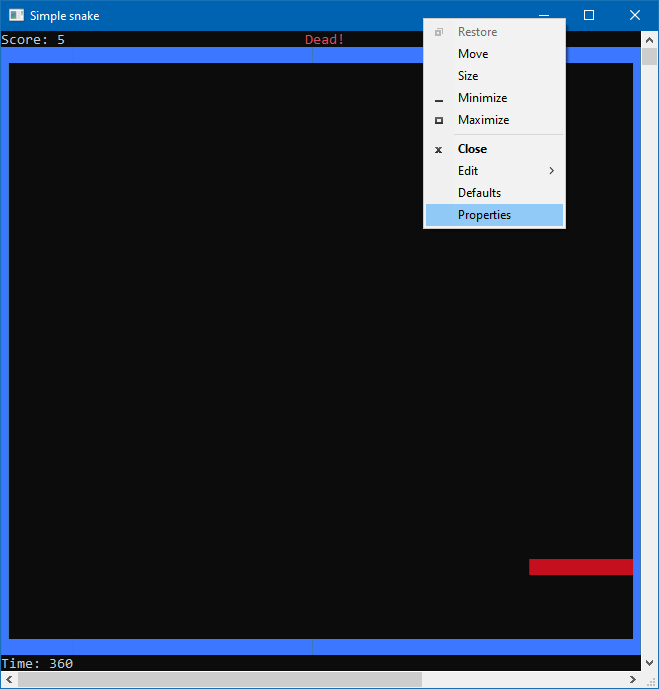
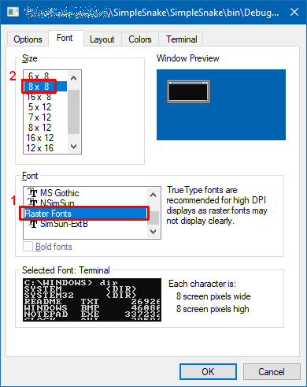
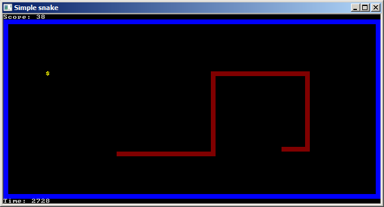

Simple snake
===================================
Version 1.1 Released by [Alexandru Dorobanțiu](http://alex.dorobantiu.ro) on 21.12.2019

### Features
 - a simple and intuitive game of snake with the purpose of a gaming tutorial
 - text mode drawing, to keep away from any framework which might be more difficult to understand
 
### Technology:
 - Written in plain **C#** using **Visual Studio 2015**
 - **.NET** framework, version **3.5**
 - The front-end is implemented in console mode (text mode). See the Screenshots below to understand how to set the font to be square.
 
#### Details
The purpose of the project is to provide a starting point for developing a simple game. 

##### Screenshots

[][CreativeCommonsLicence]
 
This work is licensed under a [Creative Commons Attribution-NonCommercial-ShareAlike 4.0 International License][CreativeCommonsLicence]

[CreativeCommonsLicence]: http://creativecommons.org/licenses/by-nc-sa/4.0/
 